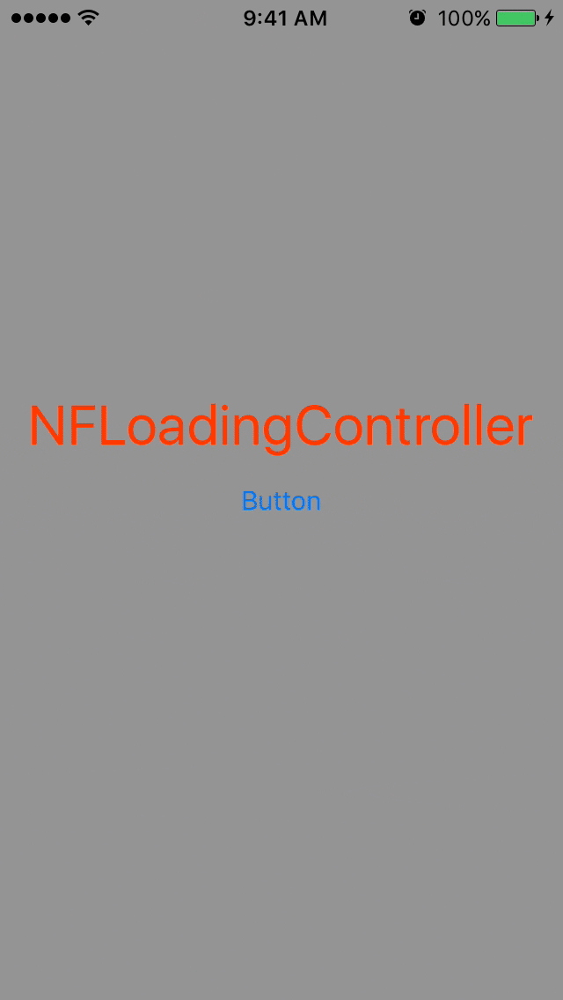

**NFLoadingController** [![] (https://camo.githubusercontent.com/0727f3687a1e263cac101c5387df41048641339c/68747470733a2f2f696d672e736869656c64732e696f2f62616467652f53776966742d332e302d6f72616e67652e7376673f7374796c653d666c6174)](https://developer.apple.com/swift/)
===


**NFLoadingController** gives you the ability to customize an activity indicator with a GIF image of your choice or the default one shown in the demo below.
**NFLoadingController** uses SwiftGifOrigin pod to play gif images.




**Usage**
=
```
import UIKit

class ViewController: UIViewController {
    var loadingController = NFLoadingController()
    override func viewDidLoad() {
        super.viewDidLoad()
        let builder = NFLoadingControllerBuilder { (builder:NFLoadingControllerBuilder) in
            builder.alpha = 0.7
            builder.image = UIImage.gif(name:"loadcat")
            builder.backgroundView = {
                let view = UIView()
                view.backgroundColor = UIColor.white
                return view
            }
            builder.frame = {
                return CGRect(x: self.view.frame.size.width/2 - 50, y: self.view.frame.size.height/2 - 50, width: 100, height: 100)
            }
            builder.presentingStyle = .popIn
            builder.dismissalStyle = .popOut
            builder.textColor = UIColor.red
            builder.textFont = UIFont.boldSystemFont(ofSize: 30)
        }
        self.loadingController = NFLoadingController(builder: builder)!
    }
    override func viewDidAppear(_ animated: Bool) {
        super.viewDidAppear(animated)
    }
    @IBAction func buttonPressed(_ sender: UIButton) {
        
        self.loadingController.present(from: self)
        
        let when = DispatchTime.now()
        DispatchQueue.main.asyncAfter(deadline: when+4) {
            self.loadingController.dismiss()
        }
    }
    override func didReceiveMemoryWarning() {
        super.didReceiveMemoryWarning()
        // Dispose of any resources that can be recreated.
    }
}
```

**Requirement**
=
- iOS 8.0+
- Swift 3.0

**Installation**
=
**CocoaPods**
-
Install [CocoaPods](cocoapods.org) with the following command:

>  gem install cocoapods

Integrate **NFLoadingController** into your Xcode project by creating a Podfile:
```
platform :ios, '9.0'
use_frameworks!

target '<Your Target Name>' do
    pod 'NFLoadingController'
end
```
Run `pod install` to build your dependencies.

**Manually**
-
Just drag NFLoadingController.swift to your project.

**How to Use?**
-
Easy try the following

```
let builder = NFLoadingControllerBuilder { (builder:NFLoadingControllerBuilder) in
	<#code#>
}
```
- **Change background's alpha**
```
builder.alpha = 1
```
- **Change background view**
```
builder.backgroundView = {
                let view = UIView()
                view.backgroundColor = .black
                return view
            }
```
- **Change frame**
```
builder.frame = {
                return CGRect(x: self.view.frame.size.width/2 - 50, y: self.view.frame.size.height/2 - 50, width: 100, height: 100)
            }
```

- **Change image**
```
builder.image = UIImage.gif(name: "waiting")!
```
- **Change presenting style**
```
builder.presentingStyle = .fade
```
**or**
```
builder.presentingStyle = .popIn
```
- **Change dismissal style**
```
builder.dismissalStyle = .fade
```
**or**
```
builder.dismissalStyle = .popOut
```
- **Change waiting Text**
```
builder.waitingText = "Please Wait"
```
- **Change text color**
```
builder.textColor = .red
```
- **Change font**
```
builder.textFont = .boldSystemFont(ofSize: 20)
```

**Demo**
=
There is a demo project added to this repository, so you can see how it works.

**License**
=
This software is released under the MIT License.
